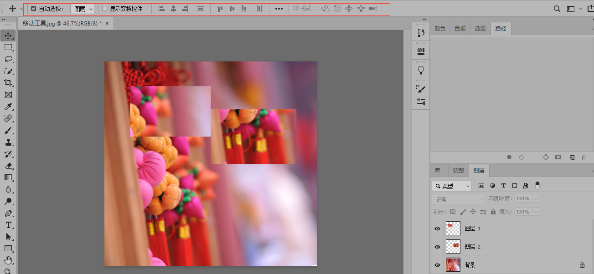
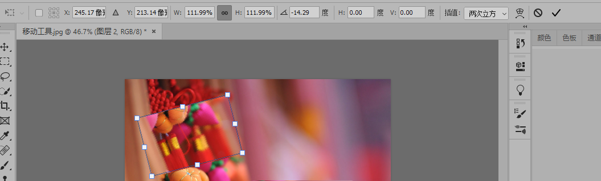

# PS2019

## 快捷键

* CTRL+D:取消选择
* CTRL+N:新建图层,可选多种像素,根据需求而定
* CTRL++,-:放大或缩小图层,效果同工具栏缩放工具
* CTRL+K:修改配置
  * 暂存盘:ps运行时的文件存放地点,不要放在系统盘,影响系统性能
* 画图像时可以使用翻转,翻转没有快捷键,需要设置:编辑->快捷键设置->图像->图像旋转->水平翻转画布->设置合适的快捷键
* 对于用套索选中的地方可以按ctrl+T对选中的区域进行规则的大小调整
* CTRL+J:将被矩形选框工具,套索工具等类似类型的工具选中的图块复制到一个新的图层中
  * 将被选中的图层使用CTRL+C,CTRL+V也可以将图层复制
* ALT:
  * 当前若是选中背景中的某个图层时,可以移动并复制该图层.注意只能复制图层
* CTRL+Z:撤销,但并不是对所有的操作都可以撤销
* DELETE:删除上一步的操作,通常CTRL+Z不行就用DELETE试试

## 菜单栏

* 窗口:可以打开右选项卡,如图层,铅笔等

## 左工具栏

* 右键点击任意工具栏,可以出现其他类型操作.若没有,表示只有该工具一种操作

  

* 

## 右边的菜单栏快捷键

* 所有的菜单可以右键点击出现其他同类型菜单
* b:画笔
* e:橡皮檫
* L:套索,选定区域
* 选中画笔的时候按F5,可出现画笔选项
* R:旋转图层

## 移动

* 右键点击移动可切换移动和画板工具

* 打开一张图片,可以看到右边选项卡的图层界面中已经横向显示了该图片,默认为背景,同时图片后有一个锁,表示该图片不能被移动.没有锁的可以直接移动,若有锁,可以如下操作

  

  * 直接移动该背景图片,会提示是否将该图片转换成正常图层,点击转换到正常图层,则该图片就可以移动
  * 点击选项卡中图层的图片后面的锁,此时该图片也将转换为正常图片
  * 点击选项卡中图层中的锁定,可以锁住该图

* 当有多个图层时,移动其他图层时,在菜单栏中可以选择自动选择图层或不自动选择

* 当有多个图层时,若同时选中多个图层,可以点击右边的对齐方式.当图层超过2个以上时,可对选中图层进行对齐和分布操作

  
  
* 选中显示变换控件时,选中某个图层,可出现明显的白色边框,点击白色边块可对图层的大小,角色等进行修改

  

## 矩形选框

* 有多种规则图形的选框可用,包括矩形,椭圆等,以矩形为例

* 在图层上用左键画出矩形选框,边框为虚线.放开左键即选中相应区域

* 左键选中该区域,按住不动可移动选中区域

* 左键点击选中区域外其他区域,可取消选中区域选框

* 按住SHIFT+左键可以建立正方形的选择区

  * 当椭圆选框工具时,建立一个圆形选择区

* 按住ALT+左键可以建立朝上方辐射的矩形选择区

* 同时按SHIFT+ALT+左键可以建立朝上方辐射的正方形选择区

* 单行和单列选框工具看起来是一条直线,其实是选择了一条像素点

* 上方菜单栏中可以选择样式,正常情况下是以固定比例选择区,固定大小则是固定像素

  

* 消除锯齿一般是选择椭圆选择区时才会用,会使弯曲处更加平滑

* 羽化:相当于让选择区的边缘软化,模糊

  

## 套索

* 该组可以称为不规则选框

* 套索工具用鼠标难度比较大,只能选择不需要太精细的图的边缘

* 多边形套索可以对精细度较高的边缘进行选择,选取的点越多越精细,结合放大镜可以选择最精细的图

* 磁性套索工具可以根据鼠标移动轨迹自动进行描点,还可以根据宽度等条件进行调节

  

  * 宽度:决定鼠标滑动多大的距离就进行一次描点,边缘比较清晰的图可以设置的高一些
  * 对比度:图形边缘模糊或者清晰,更清晰的可以设置的高些,模糊的可以设置低些
  * 频率:图层边缘上插入的点的多少

## 快速选择

* 快速选择工具类似于套索工具,对相似的颜色进行选择,点击需要选取的区域即可

* 自动增强是当选择区域时,自动选择边缘并进行优化,减少色斑和不平滑

  

* 默认是添加到选区,若是有添加多的部分,可以选择从选区减去,同时配合套索工具多选区进行适当的修剪

* 对所有图层取样是指当有多个图层时,快速选取是否对其他图层有效.若选中则会对其他图层有效,不选中则无效

* 魔棒功能和快速选取类似,但没有快速选取精确

  

* 容差:该值越小表示越类似的图片才会被选择,色差越小被选中的颜色越少,色差越大被选中的颜色越多

* 消除锯齿是为了让边缘更加平滑

* 连续是指只要颜色类似的都选中,只适用于色差比较大图层,否则容易选中不必要的区域

* CTRL+SHIFT+I:将选区反过来,是大写的i,不是L

## 裁剪

## 图框

## 吸管

## 污点修复画笔

## 画笔

* 选中画笔时,按F5,可出现更丰富的画笔选项
* 按住shift,可以画出一条直线
* 先点一个点,按住shift,再点另外一个点,可以直接画出一条直线

## 仿制图章

## 历史记录画笔

## 橡皮檫

## 渐变

## 模糊

## 减淡

## 钢笔

## 横排文字

## 路径选择

## 矩形

## 抓手

## 缩放

* 对图层进行缩放,快捷键Z
* 选中缩放之后,默认是放大模式,鼠标左键点击即可放大
* 按住ALT不放,同时点击鼠标左键即可缩小

